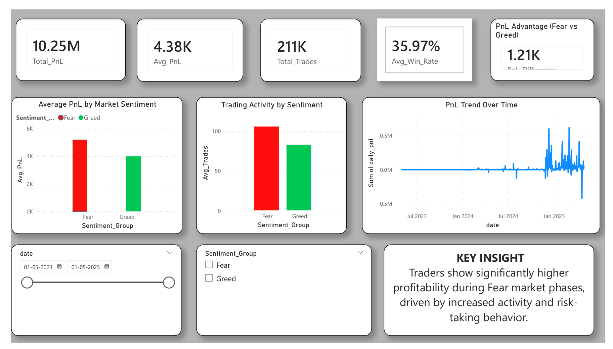
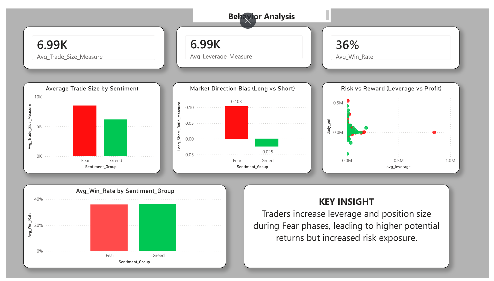
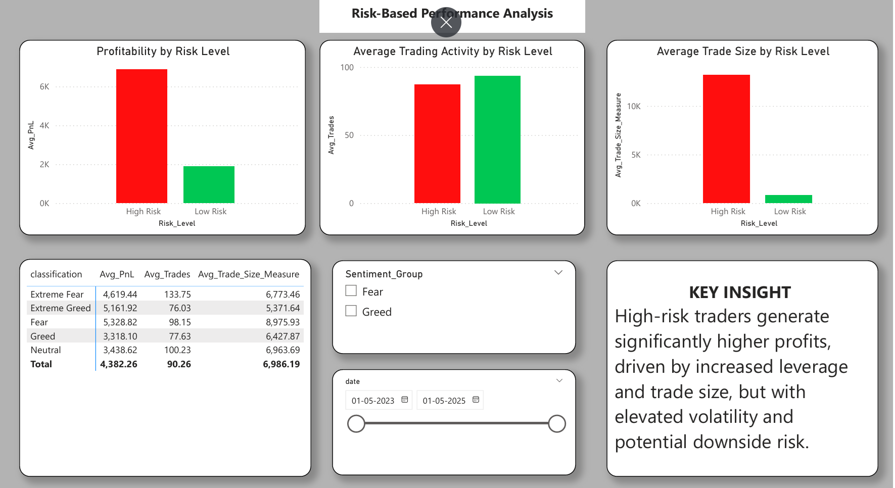

# Trader Performance vs Market Sentiment Analysis

##  Project Overview

This project analyzes how **market sentiment (Fear vs Greed)** impacts **trader behavior and profitability** using real trading data and sentiment indicators.

The analysis combines:

*  **Fear & Greed Index**
*  **Trader historical performance data**

The goal is to uncover **behavioral patterns**, **risk dynamics**, and **profitability drivers** under different market conditions.

---

##  Objective

> To understand how trader performance and behavior change across different market sentiment phases and identify actionable insights for trading strategies.

---

##  Project Structure

```
trader-sentiment-analysis/
│
├── data/
│   └── final_df.csv
│
├── notebooks/
│   └── analysis.ipynb
│
├── outputs/
│   ├── trader-sentiment-analysis.pbix
│   ├── dashboard_page1.png
│   ├── dashboard_page2.png
│   ├── dashboard_page3.png
│
├── README.md
├── summary.md
├── requirements.txt
```

---

##  Tools & Technologies

* **Python** (Pandas, NumPy)
* **Data Visualization** (Matplotlib, Seaborn)
* **Machine Learning** (Scikit-learn)
* **Power BI** (Dashboarding & storytelling)
* **Jupyter Notebook**

---

##  Methodology

### 1. Data Cleaning

* Removed inconsistencies and null values
* Standardized formats (especially timestamps)
* Ensured data integrity

---

### 2. Feature Engineering

Created key performance and behavioral metrics:

*  Daily PnL
*  Win Rate
*  Trade Count
*  Average Trade Size
*  Long/Short Ratio
*  Average Leverage

---

### 3. Data Merging

* Merged sentiment data with trading data using **date alignment**

---

### 4. Exploratory Data Analysis (EDA)

* Compared **Fear vs Greed performance**
* Analyzed **trading behavior patterns**
* Studied **risk vs reward relationships**

---

### 5. Segmentation Analysis

* Categorized traders into:

  * **High Risk**
  * **Low Risk**

* Evaluated performance differences across segments

---

### 6. Dashboard Development (Power BI)

Built an interactive **3-page dashboard** to present insights:

---

##  Dashboard Preview

###  Page 1: Executive Overview



---

### Page 2: Behavior Analysis



---

###  Page 3: Risk & Segmentation



---

##  Key Insights

*  **Trader profitability is significantly higher during Fear phases**
* **Trading activity increases during volatile (Fear) markets**
*  **High leverage leads to higher returns but increases risk**
* **Win rate alone does not determine profitability**
*  **Trader behavior is multi-factor driven, not dependent on a single metric**

---

##  Strategy Recommendations

*  Increase participation during **Fear phases** with controlled risk
*  Reduce exposure during **Greed phases** to avoid overtrading
*  Apply **risk-based strategies** for different trader segments

---

## Bonus: Predictive Modeling

* Built a **Random Forest model** to predict trader profitability
* Identified key drivers:

  * Trade frequency
  * Leverage
  * Trade size

---

##  How to Run

```bash
pip install -r requirements.txt
jupyter notebook
```

Open:

```bash
notebooks/analysis.ipynb
```

---

##  Key Takeaway

> Market sentiment strongly influences trader behavior and performance.
> Adaptive strategies based on sentiment can significantly improve outcomes.

---

##  Author

**Abhishek Hiwarkar**

---


